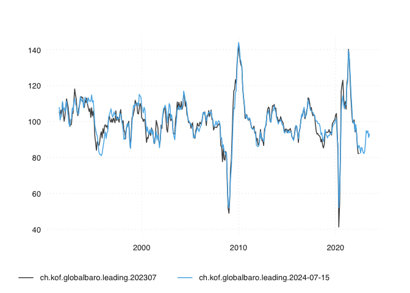

<!-- README.md is generated from README.Rmd. Please edit that file -->

# Open Time Series: Human-Friendly, Machine Readable Time Series

<!-- badges: start -->
<!-- badges: end -->

The primary goal of the opentimeseries R package is to conveniently read
time series and there meta information from *opentsi* style archives.
While Open Time Series Initiative archives use git to manage different
versions of time series and GitHub as a remote data store, reading data
does not require git to be installed on your local machine.

## Installation

You can install the development version of opentimeseries from
[GitHub](https://github.com/) with:

``` r
# install.packages("remotes")
remotes::install_github("opentsi/opentimeseries")
```

## Basic Usage

Given a unique time series identifier and a GitHub repo,
*opentimeseries* will return a time series and long format `data.table`.

``` r
library(opentimeseries)
a <- read_open_ts("ch.kof.globalbaro.leading",
                  remote_archive = "opentsi/kofethz")
a
#>                             id       date     value
#>                         <char>     <Date>     <num>
#>   1: ch.kof.globalbaro.leading 1991-07-01 107.81518
#>   2: ch.kof.globalbaro.leading 1991-08-01 100.85396
#>   3: ch.kof.globalbaro.leading 1991-09-01 103.00739
#>   4: ch.kof.globalbaro.leading 1991-10-01 103.03732
#>   5: ch.kof.globalbaro.leading 1991-11-01 111.22218
#>  ---                                               
#> 381: ch.kof.globalbaro.leading 2023-03-01  95.01878
#> 382: ch.kof.globalbaro.leading 2023-04-01  93.80463
#> 383: ch.kof.globalbaro.leading 2023-05-01  94.84820
#> 384: ch.kof.globalbaro.leading 2023-06-01  91.14499
#> 385: ch.kof.globalbaro.leading 2023-07-01  93.17270
```

By specifying a date in addition, you can able to obtain other versions
but the most recent one. The *opentimeseries* package will simply select
the most recent release that was available at the selected date.

``` r

a202307 <- read_open_ts("ch.kof.globalbaro.leading",
                        date = "2023-07-01")
```

Because time series data can get revised, storing vintages is important
to monitor data revisions and benchmark forecasts. Here’s a quick visual
comparison:

``` r
library(tsbox)
a202307$id <- sprintf("%s.202307", a202307$id)
a$id <- sprintf("%s.%s", a$id, Sys.Date())
ts_plot(rbind(a202307,a))
#> [time]: 'date'
```



## Get Entire History of a Time Series

With opentimeseries you can get the entire history of a time series.
Note that, in order to avoid nesting structures and varying output type,
unlike read_open_ts, read_history only allows for a single time series.
Hence, read_history only processes the first element of a vector of time
series when multiple series keys are given. Note how the *lastn*
parameter allows you to limit version extraction to the last couple of
versions.

``` r

hist_triangle <- read_history("ch.kof.globalbaro.leading",
 remote_archive = "opentsi/kofethz", lastn = 5)

tail(hist_triangle)
#> Key: <date>
#>          date v2025-02-01 v2025-03-01 v2025-04-01 v2025-05-01 v2025-06-01
#>        <Date>       <num>       <num>       <num>       <num>       <num>
#> 1: 2024-01-01    111.4755   111.93393   112.22277   112.43953   112.40559
#> 2: 2024-02-01    105.5114   104.87135   105.00907   105.40360   105.42741
#> 3: 2024-03-01          NA    99.14223    98.91744    98.99472    99.09614
#> 4: 2024-04-01          NA          NA   101.05006   101.19983   101.32582
#> 5: 2024-05-01          NA          NA          NA   102.78880   102.89490
#> 6: 2024-06-01          NA          NA          NA          NA   103.87232
```
