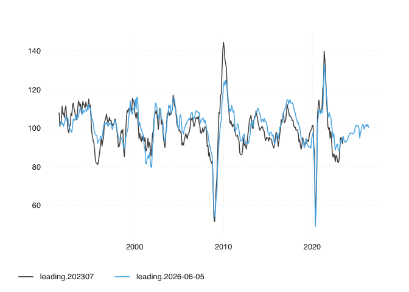

<!-- README.md is generated from README.Rmd. Please edit that file -->

# Open Time Series: Human-Friendly, Machine Readable Time Series

<!-- badges: start -->

[](https://lifecycle.r-lib.org/articles/stages.html#experimental)
[](https://github.com/opentsi/opentimeseries)
<!-- badges: end -->

The primary goal of the opentimeseries R package is to conveniently read
time series and there meta information from *opentsi* style archives.
While Open Time Series Initiative archives use git to manage different
versions of time series and GitHub as a remote data store, reading data
does not require git to be installed on your local machine.

## Installation

You can install the development version of opentimeseries from
[GitHub](https://github.com/) with:

``` r
# install.packages("remotes")
remotes::install_github("opentsi/opentimeseries")
```

## Basic Usage

Given a unique time series identifier and a GitHub repo,
*opentimeseries* will return a time series and long format `data.table`.

``` r
library(opentimeseries)
a <- read_open_ts("leading",
                  remote_archive = "opentsi/ch.kof.globalbaro")
a
#>           id       date    value
#>       <char>     <IDat>    <num>
#>   1: leading 1991-07-01 101.5254
#>   2: leading 1991-08-01 101.6025
#>   3: leading 1991-09-01 101.8892
#>   4: leading 1991-10-01 103.5929
#>   5: leading 1991-11-01 101.8006
#>  ---                            
#> 415: leading 2026-01-01 101.1284
#> 416: leading 2026-02-01 101.6809
#> 417: leading 2026-03-01 100.7737
#> 418: leading 2026-04-01 101.7341
#> 419: leading 2026-05-01 100.3021
```

By specifying a date in addition, you can able to obtain other versions
but the most recent one. The *opentimeseries* package will simply select
the most recent release that was available at the selected date.

``` r

a202307 <- read_open_ts("leading", remote_archive = "opentsi/ch.kof.globalbaro",
                        date = "2023-07-01")
```

Because time series data can get revised, storing vintages is important
to monitor data revisions and benchmark forecasts. Here’s a quick visual
comparison:

``` r
library(tsbox)
a202307$id <- sprintf("%s.202307", a202307$id)
a$id <- sprintf("%s.%s", a$id, Sys.Date())
ts_plot(rbind(a202307,a))
#> [time]: 'date'
```



## Get Entire History of a Time Series

With opentimeseries you can get the entire history of a time series.
Note that, in order to avoid nesting structures and varying output type,
unlike read_open_ts, read_history only allows for a single time series.
Hence, read_history only processes the first element of a vector of time
series when multiple series keys are given. Note how the *lastn*
parameter allows you to limit version extraction to the last couple of
versions.

``` r

hist_triangle <- read_ts_history("leading",
 remote_archive = "opentsi/ch.kof.globalbaro", lastn = 5)

history_triangle(hist_triangle)
#> Key: <date>
#>            date v2026_01_10 v2026_02_10 v2026_03_10 v2026_04_24 v2026_05_15
#>          <IDat>       <num>       <num>       <num>       <num>       <num>
#>   1: 1991-07-01    99.48325    98.83764    98.33082    98.31089    101.5254
#>   2: 1991-08-01    98.27271    98.93623    97.57223    97.65314    101.6025
#>   3: 1991-09-01    97.06995    96.56613    95.89677    95.96742    101.8892
#>   4: 1991-10-01    99.44793    99.88413    99.33328    99.39286    103.5929
#>   5: 1991-11-01    97.86152    99.04062    99.72495    99.78044    101.8006
#>  ---                                                                       
#> 415: 2026-01-01   102.05887   101.41490   102.20381   102.10795    101.1284
#> 416: 2026-02-01          NA   101.71599   102.66818   102.52491    101.6809
#> 417: 2026-03-01          NA          NA   101.25461   101.22070    100.7737
#> 418: 2026-04-01          NA          NA          NA   102.87728    101.7341
#> 419: 2026-05-01          NA          NA          NA          NA    100.3021
```
